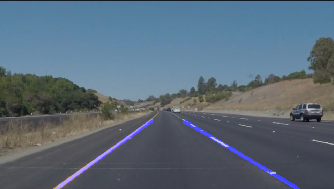
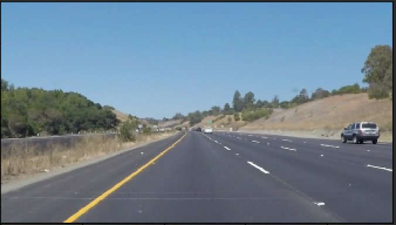
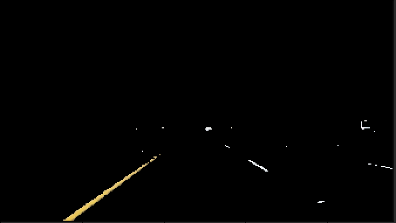
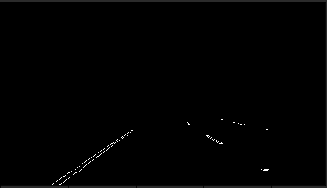
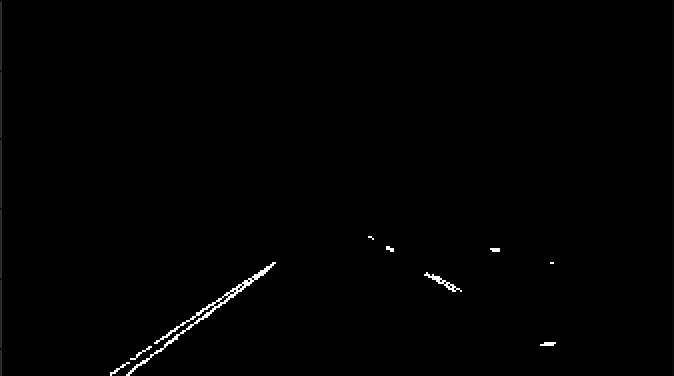
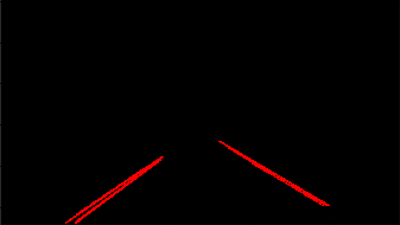

# **P1: Finding Lane Lines on the Road**

### Hengjiu Kang, Feb.22 2017

---

**Finding Lane Lines on the Road**

The goals / steps of this project are the following:
* Make a pipeline that finds lane lines on the road
* Reflect on your work in a written report



---

# Reflection

## 1. Pipline design
```
 raw_image ->  select color with yellow and white -> grayscale, smooth, Canny ->
 1st pass Hough transform -> 2nd pass Hough transform -> find explicit two lanes ->
 draw lines on the original image
```


1. raw_image

    
2. select color with yellow and white

    I hard coded the color in the algorithm:
    ```python
     # color selection
    final_color_yellow, mask_yellow = color_mask(image, 'hsv', (10, 100, 100), (30, 255, 255))
    final_color_white, mask_white = color_mask(image, 'bgr', (200, 200, 200), (255, 255, 255))
    ```

    
3. Grayscale, smooth and canny
    Then I do the Grayscale, Smooth and Canny operation in normal way.
    ```python
    gray_image = grayscale(final_color)
    smooth_image = gaussian_blur(gray_image, 3)

    # Define our parameters for Canny and apply
    low_threshold = 1
    high_threshold = 150
    edges = cv2.Canny(smooth_image, low_threshold, high_threshold)
    ```

    
4. 1st pass hough transform
    I though gave it a 2-stage hough transform is a good idea.
    During the first pass I can use rough setup to find more
    lines, extract as much as possible information, especially
    the right lane.
    ```python
    rho = 1  # distance resolution in pixels of the Hough grid
    theta = np.pi / 180  # angular resolution in radians of the Hough grid
    threshold = 10  # minimum number of votes (intersections in Hough grid cell)
    min_line_len = 5  # minimum number of pixels making up a line
    max_line_gap = 2  # maximum gap in pixels between connectable line segments
    line_image = np.copy(image) * 0  # creating a blank to draw lines on
    hough_image, first_hough = hough_lines(masked_edges, rho, theta, threshold, min_line_len, max_line_gap)
    hough_image = cv2.cvtColor(hough_image, cv2.COLOR_RGB2GRAY)
    ```

    
5. 2nd pass hough transform
    During the second pass, I used higher precision, to remove
    noise and connect the right lane.
    ```python
    rho = 1  # distance resolution in pixels of the Hough grid
    theta = np.pi / 360  # angular resolution in radians of the Hough grid
    threshold = 50  # minimum number of votes (intersections in Hough grid cell)
    min_line_len = 50  # minimum number of pixels making up a line
    max_line_gap = 150  # maximum gap in pixels between connectable line segments

    hough_image_2, second_hough = hough_lines(hough_image, rho, theta, threshold, min_line_len, max_line_gap)
    ```

    
6. Find and draw lines on the original image
    The last step is finding out two lanes. I think it would be better
    to use some classification method like SVM, but eventually I found that
    it overkill and not neccessary **under this project with these
    high quality videos**

    

## 2. Potential problems
### Fixed parameters
All the test condition images and videos have really good quality, including
resolution and lightness, and my parameter tunning is depends on these
materials. So if the weather is bad or it is simply dark, this program
may not work correct. Or in the other words, this lane finding program
does not designed to be self optimized.

### Lacking of data assertion
Recall that parameters were hard coded, and I used a lot of data indexing
 in the script without data dimension checking, outOfBound exception
 will be happened when


### Lacking of optimization
Computer vision always costs a lot of computer power, and in this program
I dont use any of the optimization configuration, so the detecting speed
could be slow.


## Possible improvements
### Find lanes by bitmask
One potential improvements will be using color selection mask rather than
the image it self.
So the pipeline will be the following:
```
 raw_image -> color mask with yellow and white -> Canny ->
 1st pass Hough transform -> find explicit two lanes ->
 draw lines on the original image
```
In this pipline, we can save grayscale and smoothing process, and the data
will be only one dimensional rather than three dimensional. However in the
real test, I found that mask is too sharp to make successful Hough transform.
One solution will be removing Canny edge detection, to "inflate" the lanes.

### Using Auto image adjustment
As mentioned above, low image quality and bad weather will result in
failure lanes recognition, so image adjustment method can be used to
change
